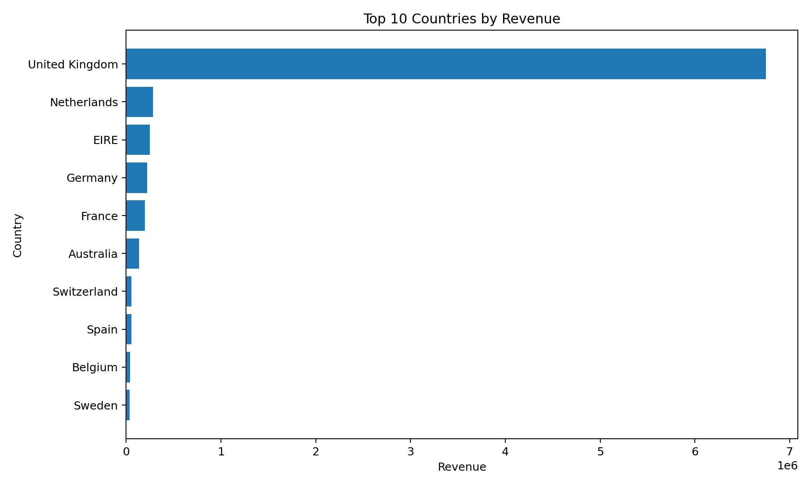
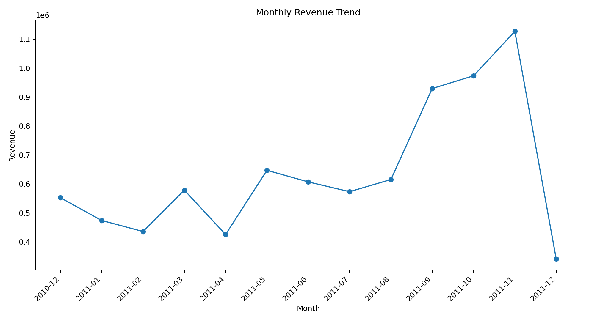
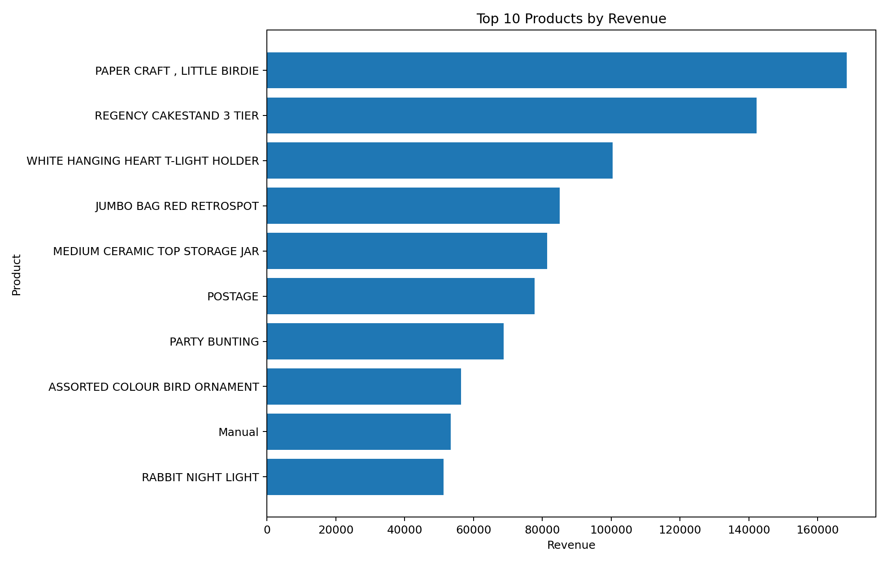
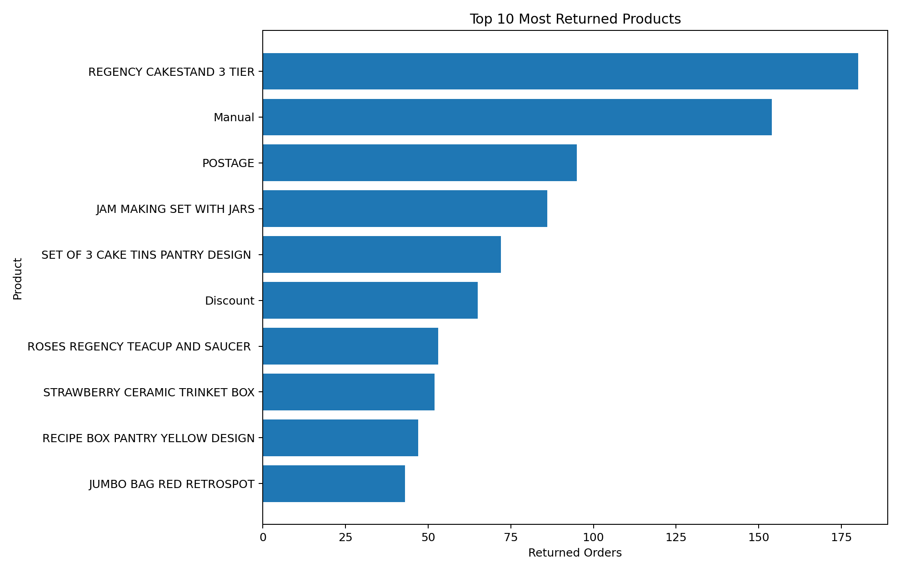
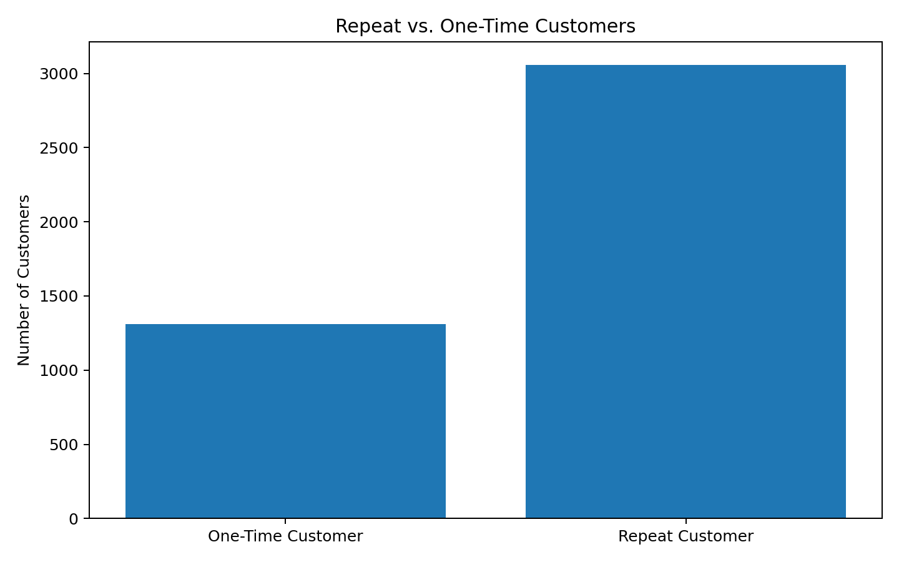
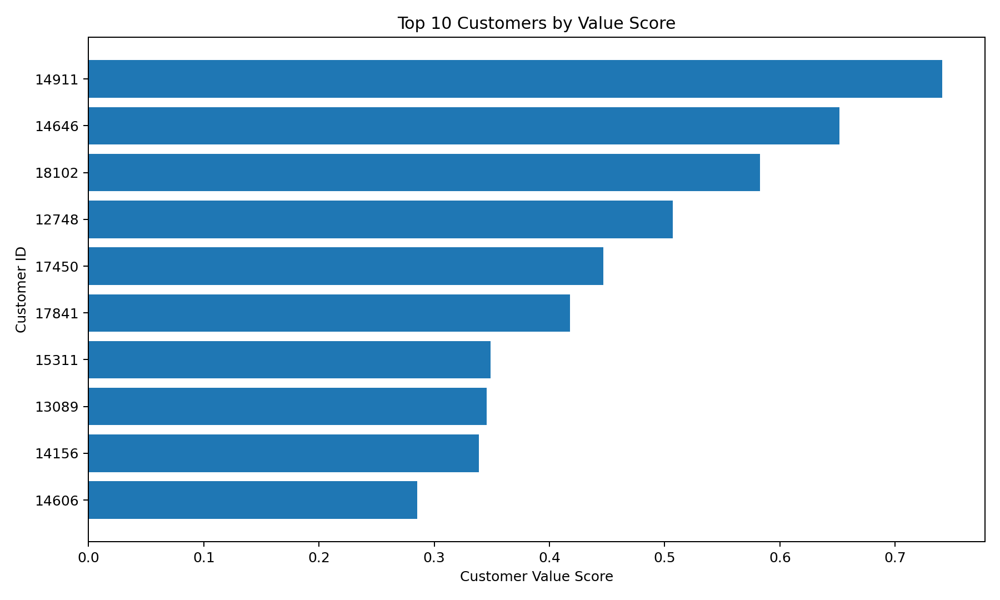
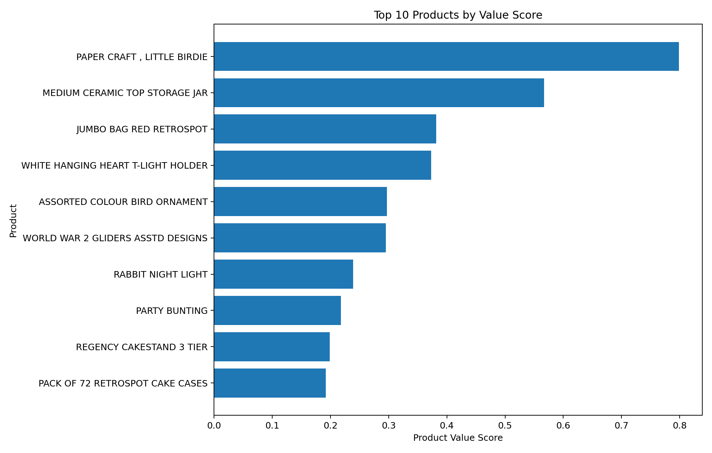

# E-Commerce Customer Analysis

## Overview

This project analyzes customer purchasing behavior, product performance, revenue trends, and returns using the **UCI Online Retail dataset**.

The project combines **Python, Pandas, SQL, and SQLite** to create an end-to-end analytics workflow. Python and Pandas are used to clean and prepare the raw data, SQL is used to answer business questions, and Pandas is used for additional customer and product analysis.

## Business Objective

The goal of this project is to analyze e-commerce transaction data to better understand:

- Revenue performance
- Customer purchasing behavior
- Repeat customers
- Product performance
- Returns and cancellations
- Opportunities to increase revenue and improve customer retention

## Tools Used

- **Python**
- **Pandas**
- **SQL**
- **SQLite**
- **VS Code**
- **Git / GitHub**

## Dataset

The project uses the **UCI Online Retail dataset**, which contains transaction-level data from an online retailer.

Important columns include:

- `InvoiceNo`
- `StockCode`
- `Description`
- `Quantity`
- `InvoiceDate`
- `UnitPrice`
- `CustomerID`
- `Country`

## Data Cleaning

The raw Excel dataset was cleaned using Python and Pandas before being loaded into SQLite.

The cleaning process included:

- Removing missing values
- Removing duplicate rows
- Removing transactions with zero or negative unit prices
- Converting `CustomerID` to an integer
- Identifying returns and cancellations
- Calculating revenue
- Extracting date and time information from transactions

Additional columns created:

- `Returns`
- `Revenue`
- `Year`
- `Month`
- `DayOfWeek`
- `Hour`

After cleaning, the dataset was stored in a SQLite database as the `transactions` table.

## Business Questions

The analysis was designed to answer the following questions:

1. Which countries generate the most revenue?
2. Which products generate the most revenue?
3. Which products sell the most units?
4. How does revenue change month-to-month?
5. Which days of the week generate the most revenue?
6. What hours of the day generate the most revenue?
7. Who are the highest-value customers?
8. How concentrated is revenue among the top 10 customers?
9. Which countries have the highest average order value?
10. What percentage of orders are returns/cancellations?
11. Which products are returned the most?
12. How much revenue is lost to returns?
13. How many customers are repeat vs. one-time customers?
14. What percentage of revenue comes from repeat customers?
15. Who are the most valuable customers based on spending and purchase frequency?
16. Which products perform best based on revenue, quantity sold, and returns?
17. Which products are most popular among repeat customers?
18. Which countries have the highest percentage of repeat customers?

## Key Findings

- The United Kingdom generated the majority of total revenue.
- A small group of customers contributed a significant share of revenue.
- Repeat customers generated a large portion of overall revenue.
- Certain high-selling products also experienced relatively high return activity.
- Revenue varied considerably across months, showing clear seasonal patterns.

## Recommendations

- Prioritize retention strategies for high-value repeat customers.
- Investigate frequently returned products to identify quality or expectation issues.
- Focus marketing efforts on high-revenue products and markets.
- Use seasonal revenue patterns to guide inventory and promotional planning.

## Visual Analysis

### Revenue by Country

The following chart highlights the countries generating the highest total revenue.



### Monthly Revenue Trend

Monthly revenue was analyzed to identify changes in sales performance over time.



### Top Products by Revenue

The highest-revenue products were identified to understand which products contribute most to sales.



### Most Returned Products

Return activity was analyzed to identify products associated with the greatest number of returned orders.



### Repeat vs. One-Time Customers

Customers were classified based on whether they placed more than one order.



### Customer Value Scores

Customers were ranked using a value score combining total revenue and purchase frequency.



### Product Value Scores

Products were ranked using revenue, quantity sold, and returns, with returns negatively affecting the final score.



## Customer Value Analysis

To identify the most valuable customers, I analyzed both:

- Total revenue generated by each customer
- Number of orders placed by each customer

Because revenue and order frequency are measured on different scales, I used **min-max normalization** to convert both metrics to values between 0 and 1.

The final customer value score uses equal weighting:

```text
Customer Value Score =
0.50 × Revenue Score
+ 0.50 × Frequency Score
```

This allows customers who both spend more and purchase more frequently to rank higher.

## Product Performance Analysis

Product performance was analyzed using:

- Total revenue
- Total quantity sold
- Product returns

SQL was used to calculate product sales and returns, and the results were merged using Pandas.

The metrics were then normalized so they could be compared on the same scale.

Returns were treated as a negative factor because products with high sales but high returns may not actually be performing as well as their sales numbers suggest.

## Project Structure

```text
ecommerce-customer-analysis/
│
├── Data/
│   └── Online Retail.xlsx
│
├── Images/
│
├── analysis.py
├── analysis.sql
├── ecommerce.db
└── README.md
```

### analysis.py

Used for:

- Loading the dataset
- Cleaning the data
- Feature engineering
- Creating the SQLite database
- Customer value scoring
- Product performance scoring

### analysis.sql

Contains the SQL queries used to answer the business questions.

### ecommerce.db

Contains the cleaned transaction data used for the SQL analysis.

## Workflow

```text
Raw Excel Data
      ↓
Python / Pandas Cleaning
      ↓
Feature Engineering
      ↓
SQLite Database
      ↓
SQL Analysis
      ↓
Pandas Customer & Product Analysis
      ↓
Business Insights
```

## Skills Demonstrated

This project demonstrates experience with:

- Python
- Pandas
- SQL
- SQLite
- Data cleaning
- Data validation
- Feature engineering
- SQL aggregation
- Common Table Expressions (CTEs)
- SQL joins
- Conditional aggregation
- Customer segmentation
- Min-max normalization
- Pandas DataFrame operations
- DataFrame merging
- Customer and product scoring
- Translating business questions into data analysis

## Future Improvements

Possible future improvements include:

- Building a Tableau or Power BI dashboard
- Customer RFM segmentation
- More detailed product return-rate analysis
- Customer cohort analysis
- Customer lifetime value analysis
- Automating the data pipeline

## Author

**Alexander Gonzalez**

Business Analytics student developing skills in SQL, Python, data analysis, and analytics engineering.